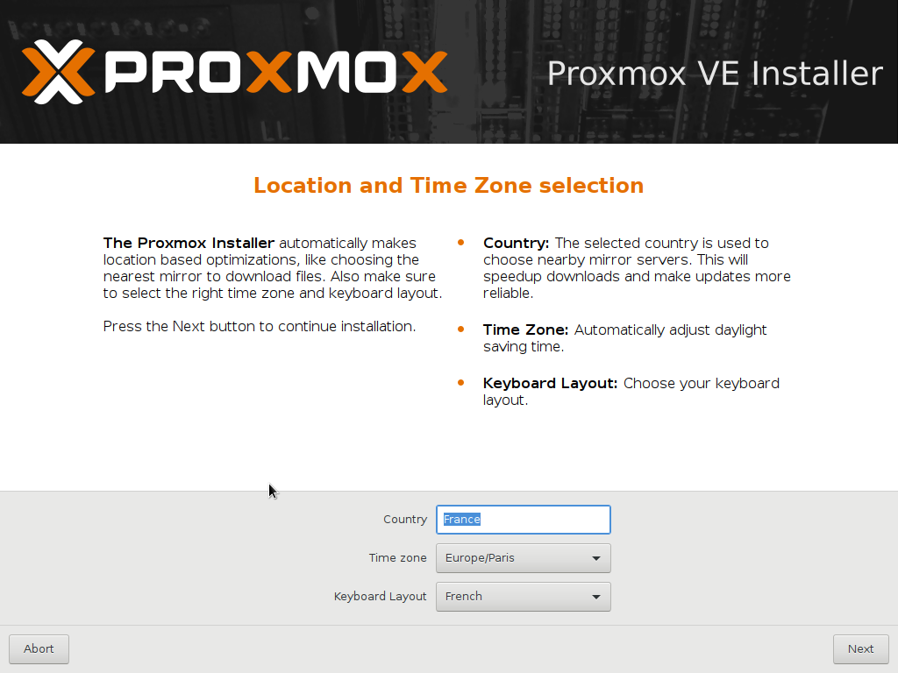

####début de brouillon######


* [Présentation](#présentation)
* [Installation de base du serveur](#installation-de-base-du-serveur)
* [Interface web de gestion](#interface-web-de-gestion)
* [Ajout de disques durs internes pour stocker les vm ou les sauvegardes](#ajout-de-disques-durs-internes-pour-stocker-les-vm-ou-les-sauvegardes)
* [Ajout de livecd iso pour booter une vm](#ajout-de-livecd-iso-pour-booter-une-vm)
* [Création de machine virtuelle](#création-de-machine-virtuelle)

## Présentation

Proxmox est un puissant système de virtualisation basé sur Debian et qui utilise KVM. Il permet à la façon de virtualbox de créer des  snapshots de machine, des sauvegardes complètes et beaucoup d'autres fonctionnalités. 
Le serveur et les vms peuvent se gérer à partir d'une interface web, et une gestion possible des comptes utilisateurs va permettre de laisser à des tiers un accès avec plus ou moins de droits sur une machine (comme le serveur bcdi par exemple).  

L'installation pourra se faire avec les paquets proxmox, mais il sera bien plus pratique d'utiliser l'iso toute faite sur le site officiel de proxmox:
https://www.proxmox.com/en/downloads

## Installation de base du serveur

L'installation est très simple: très peu de choses sont demandées. On regrêtera cependant le peu de choix concernant le partionnement du serveur.

Dans l'installation présentée, il y a trois disques dur: Le premier va servir à installer le système. Le second servira à stocker les machines virtuelles et le troisième servira à stocker les sauvegardes de machines.

sda 500 Go, sdb 100 Go et sdc 500 Go.


On choisit d'installer proxmox sur l premier disque sda.  Les autres disques serviront à stocker des sauvegardes de machines (les snapshots sont placés dans le même espace de stockage que les machines), des fichiers iso de livecd pour les machines,etc...

Pour virtualiser un serveur comme le `se3`, il sera clairement conseillé de mettre plusieurs disques identiques et d'utiliser un système zfs avec du cache ( aller voir dans `options`). Les machines virtuelles pourront elles être en autres formats (xfs,ext4,ntfs...)


On choisit la langue, ainsi que la ville et le type de clavier.


**Choix du mdp root**


On entrera une **adresse mail valide** pour que le serveur puisse envoyer des alertes à l'administrateur.

**choix du réseau**


Entrer l'ip du serveur, pour le dns, on pourra choisir l'ip du `Amon`, oun dns externe comme celui de google.
L'installation des paquets est automatique.

Le serveur redémarre , et indique comment acceder à l'interface de gestion. On peut acceder evidemment au serveur en ssh (connexion directe par le compte root possible).


### Quelques points à modifier pour la gestion du serveur**

**Reglage du proxy** 
Il faudra se connecter en root sur le serveur et configurer le proxy en ligne de commande

```
export http_proxy="http://172.20.0.1:3128"
export https_proxy="http://172.20.0.1:3128"
export ftp_proxy="http://172.20.0.1:3128"
```


**Configuration de l'envoi de mail par le serveur**
Pour que le serveur puisse envoyer les alertes par mail, on va installer le paquet en lgne de commande
```
apt-get update
apt-get install ssmtp

```
On modifie le fichier de configuration
```
nano /etc/ssmtp/ssmtp.conf
```

Il suffira ensuite de copier le contenu du fichier de conf /etc/ssmtp/ssmtp.conf du se3 sur celui du serveur `proxmox`.

Voici à quoi doit ressembler le contenu du fichier.

```
# Genere par l'interface de Se3
root=marc.bansse@ac-versailles.fr
mailhub=smtp.nerim.net
rewriteDomain=lyc-prevert-longjumeau.ac-versailles.fr
hostname=lyc-prevert-longjumeau.ac-versailles.fr
```


**modification des sources**
Il est possible de récupérer les mises à jour de proxmox sans payer de cotisation en utilisant le dépot non-entreprise. La méthode est décrite ici.

https://pve.proxmox.com/wiki/Package_Repositories

## Interface web de gestion
Pour gérer le serveur et les machines virtuelles,il suffit d'utiliser un navigateur et de se rendre à l'adresse indiquée. 


**ATTENTION**, il faudra peut-être désactiver le proxy du navigateur pour accéder à l'interface.

On indique le mode `pam authentification`, puis le login "root", et mdp.


Par la suite, il sera possible de créer des comptes utilisateurs `proxmox` pour permettre à d'autres personnes de démarrer/éteindre/gérer des vms.

Un message d'erreur indique que le serveur n'est pas enregistré, ce qui est normal. Ignorer donc cet avertissement.


On arrive sur l'interface. 
On observe la présence d'un datacenter, qui pourra contenir plusieurs serveurs `proxmox` (noeuds ou clusters).Ici il n'y en a qu'un (nom netbios pve).


Datacenter | rôles
-----------|--------
résumé     | permet de voir l'état général des clusters.
options    | permet de changer les réglages claviers,proxy logiciel, adresse mail expéditeur
stockage   | permet d'ajouter des espaces de stockage (répertoire locaux,partage ntfs,iscsi...) et d'indiquer quel type de données ils contiendront (images iso,vms,sauvegardes...). 
sauvegarde | permet de programmer des sauvegardes de machines.
permissions| permet de gérer/créer des comptes utilisateurs,groupes utilisateurs


**contenu des disques**
Il faudra indiquer pour chaque espace de stockage ce qu'ils contiendront:

dénomination | type de données stockées
-----------|--------
image iso | livecd ou autre image de cd.
conteneur et images disques | vm ou conteneur lxc (et snapshots mis automatiquement au même endroit).
fichier sauvegarde vzdump | export de machine pour sauvegarde complète.

Ensuite, nous tronvons le premier serveur de vm. 

noeud PVE1| rôles
-----------|--------
résumé     | permet de voir les stats d'utilisation du serveur(CPU,RAM...).
shell      | permet d'ouvrir un terminal sur le serveur (plus besoin de putty ou autre connecteur ssh).
Système    | permet de cchanger les paramètres réseau,dns,voir les logs de syslog...
Mises à jour| Comme son nom l'indique, permet de faire les mises à jour serveur.
disques    | Permet de voir l'état des disques durs (smartvalues)

Ensuite, nous trouvons une ligne pour chaque espace de stockage. Le disque de départ est  partionné en deux parties distinctes:
*local(pve)* qui prend environ 1/5 du disque sda .
*local-lvm  (pve)*, l'espace restant 

On pourra ajouter d'autres espaces (voir la suite)

De base, le systeme est installé sur la partie `local (pve)`, les vms et snapshots seront écrites sur cet espace dans `/var/lib/vz`  si on ne modifie rien. 
Le reste du disque est organisé en lvm et pourra contenir les sauvegardes et images iso de livecd.


Il suffit de double cliquer sur l'espace de stockage pour changer le type de données qu'on va y mettre.


## Ajout de disques durs internes pour stocker les vm ou les sauvegardes

Dans l'exemple suivant, on choisit de mettre ses vm et les sauvegardes dans deux disques qui seront montés dans /vm et dans /sauvegardes.

Il faut évidemment créer ces répertoire sur le serveur avec la commande *mkdir*.

Chaque disque doit posséder une partition valide et doit êre formaté. 

On repère l'UUID du disque en faisant:
```
blkid
```


Ensuite, il suffira de modifier le fichier [/etc/fstab] pour que le disque soit automatiquement monté au démarrage.


On peut vérifier si cela fonctionne correctement à chaud en faisant sur le shell serveur
```
bmount -a
mount
```
La dernière commande doit indiquer que les deux disques sont bien montés dans le répertoire choisi. 
Il faut maintenant indiquer au serveur qu'il doit utiliser ces espaces de stockage ajoutés.

On peut faire `datacenter>stockage>ajouter> répertoire`. On y écrit le répertoire choisi comme point de montage.


On choisi également le type de contenu que l'on souhaite y mettre:


## Ajout de livecd iso pour booter une vm 
On va sur le serveur (et non plus sur datacenter), on se place sur l'espace choisi pour mettre les iso (ex local-sav) puis `résumé>upload`, on ajoute le fichier iso qui a été téléchargé sur un poste quelconque.


Ces iso peuvent être des netinstall debian, livecd clonezilla, disques d'installation de windows server ou tout autre livecd.


## Création de machine virtuelle

**Configuration de l'ID de la VM**


Les VM sont repérées par leur numéro (ici 100). On donnera le nom souhaité pour plus de clareté.

**Configuration du cd-rom.**

Il faut ensuite choisir le contenu du cd-rom. On peut utiliser une des iso que l'on a auparavant uploadé sur le serveur, ou alors utiliser le cd-rom de l'hote, voir aucun cd-rom si tout est fait en pxe.


On choisir aussi si le système d'exploitation de la future machine virtuelle.


**Configuration du disque dur.**


Remarque:Comme pour Virtualbox, la place prise réellement sur le disque dur sera la place occupée par la VM, et non la taille choisie du disque.

*J'utilise pour mes serveurs le mode `SATA`, mais il est possible que les résultats soient meilleurs avec d'autres reglages.*

**Reglage CPU**

On peut choisir le nombre de coeurs du processeur. L'aide indique que l'on peut mettre sans problème plus de coeurs virtuels que de coeurs réels du serveur hote.


**Mémoire**

On indique la quantité de RAm à allouer à la VM. On peut utiliser une quantité dynamique pour les serveurs fonctionnant par intermittence.


**réseau**

Il ne reste plus qu'à choisir les caractéristiques du réseau. On prendra le mode bridge, pour que la VM puisse avoir une ip du mme genre que la machine hote.

Il sera également possible de choisir différents modèles de cartes réseau. Pour des VM Windows, il sera préférebale de prendre un modèle du style `Réaltek` qui sera reconnu nativement sans avoir à installer de drivers


On valide la dernière étape et la Machine Virtuelle est presque prête.

**Activation de l'affichage**

Lorsque la machine vient tout juste d'pêtre créée, il est indispensable d'avoir un affichage de l'écran. Pour cela, cliquer sur la VM, puis options et activer `Agent Qemu` sur Yes.


Une fois que tout ceci est prêt, on peut enfin démarrer sa VM. Il suffira d'aller dans l'onglet `Console` pour voir ce qu'indique la VM.


On peut aussi utiliser le mode plein écran pour travailler dans de meilleurs conditions.


## Migration d'un serveur physique existant vers une VM `Proxmox`
a venir

**snapshots**
**savegarde complète d'une machine**
**restauration d'une machine**


